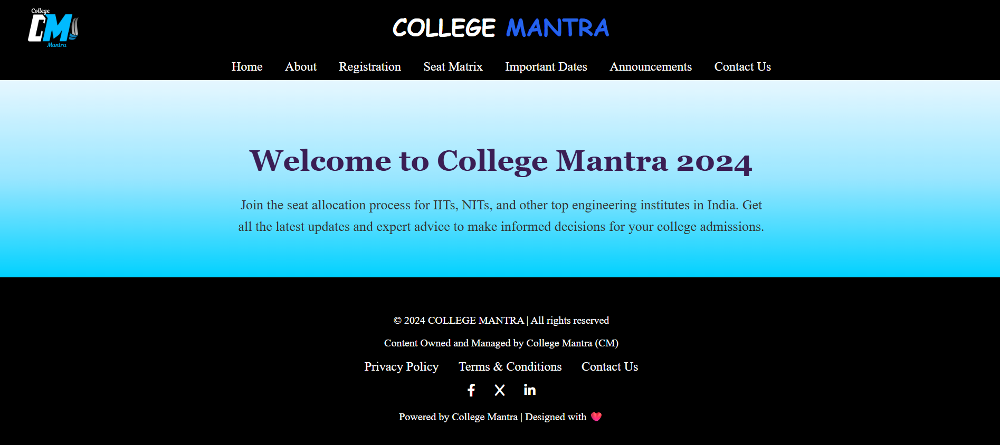
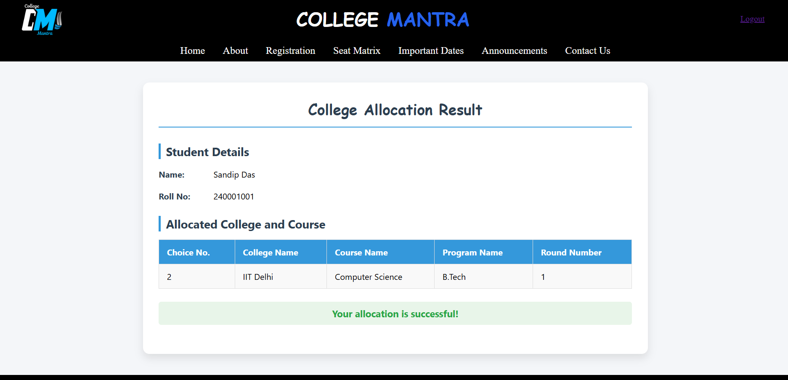
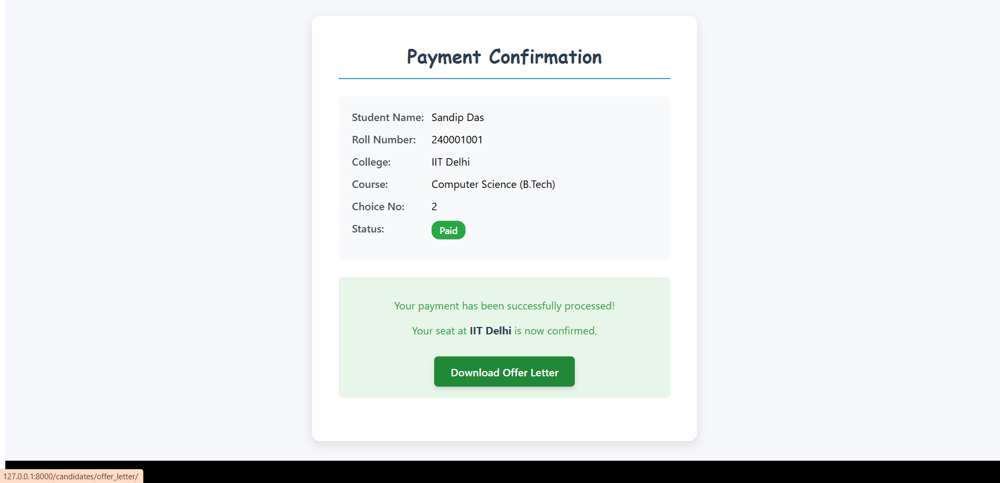

# 🎓College Mantra - College Allocatin Platform

A web-based College Allocation System that streamlines and automates the college admission process based on student **preferences**, **catagory**, **rank**, and **seat availability**.

Built Frontend using **HTML** ,**CSS** and **JavaScript**, Backend using **Django (python)** and Database **MySQL**.

---

## 🌐 Live Preview

> ⚠️ This app is designed for **local fullstack deployment**.

---

## 🖼️ Screenshots

### 🏠 Home Page  


### 📋 Preference Page  


### 🎯 Allocation Page  


### 💳 Payment Page  


### ✅ Payment Confirmation & 📄 Offer Letter Download  


---

## ✨ Features

- 📝 **Candidate Registration** - Users can register with their details and create an account securely.
- 🔐 **User Authentication** - Login and session management for candidates to access their dashboard.
- 🧑‍💼 **Submit Own Details** - Candidates can fill in their personal information, academic scores, and category details required for the admission process.
- 📋 **Preference Filling** - Candidates can select and rank colleges and courses based on their choices.
- 🧮 **Automated Seat Allocation** - System allocates seats using a reservation-aware algorithm with category and rank-based logic.
- 🎯 **Real-time Allocation View** - Candidates can view their allocated college and course after the allocation round.
- 💳 **Secure Payment Gateway** - Candidates can confirm their seat by completing payment and checking payment status.
- 📄 **Offer Letter Download** - After successful payment, candidates can download a PDF offer letter containing allocation details.
- 🏛️ **Admin-Defined College & Course Data** - System supports dynamic management of colleges, courses, and seat matrices by admins.
- 🗃️ **MySQL Integration with Triggers & Procedures** - Backend built with normalized MySQL schema, triggers for seat updates, and a robust seat allocation procedure.

---

## 🛠️ Tech Stack

| Layer        | Technology / Tools                                                                 |
|--------------|-------------------------------------------------------------------------------------|
| **Frontend** | HTML5, CSS3, JavaScript, Bootstrap 5 / Tailwind CSS, Responsive Design             |
| **Backend**  | Python 3, Django Framework (MVC), Raw SQL, MySQL Stored Procedures                 |
| **Database** | MySQL — Normalized Schema, Triggers, `AllocateSeats()` Stored Procedure            |
| **PDF Gen.** | reportlab (`from reportlab.pdfgen import canvas`) for generating offer letters     |
| **Tools**    | Git, GitHub, MySQL Workbench, VS Code, Postman (optional for API testing)          |


## 🧪 Setup Instructions

1. **Clone the repo**
   ```bash
   git clone https://github.com/Subhankar191/college_allocation.git
   cd college_allocation
